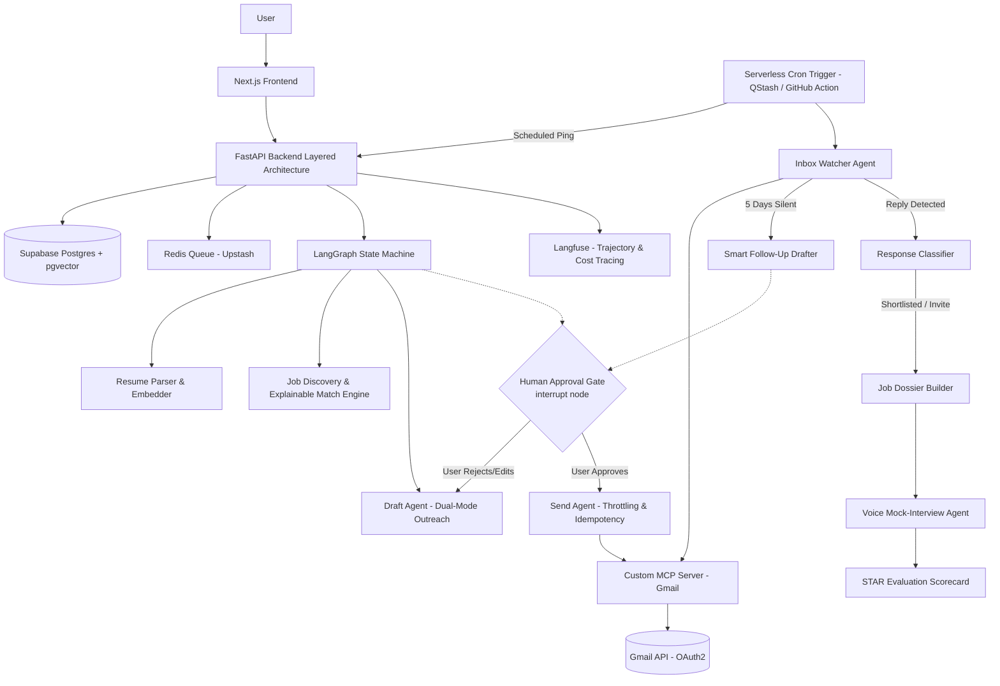

# PRD — AgentHire
### Autonomous, Human-in-the-Loop Job Application & Interview-Prep Platform

**Version:** 1.1 (Improvised Architecture & Production-Ready Spec)  
**Owner:** Solo developer (you) — Tech Lead + Sole Engineer  
**Target build time:** 1 month, solo  
**Cost target:** $0 — every service on free tier  

---

## 0. Interpretation Notes (read this first)

Some requirements were described conversationally. Here's how they're translated into concrete specs, so there's no ambiguity while building:

| You said | Built as |
|---|---|
| "agent which will throw to an entire internet and get me the press link" | **Job Discovery Agent** — searches job-board APIs + company career pages, returns job postings matched to your resume with explainable skill gap scoring |
| "I'll be just giving you the loop" | **Human-in-the-loop approval** — agent drafts, you review/edit, you approve before anything is sent (hard gate in LangGraph state machine) |
| "call through my mail list inboxes and see the mail" | **Inbox Watcher Agent** — polls Gmail (label-scoped) to confirm send, detect replies, and draft follow-ups if ghosted |
| "voice agent will call to the internet... make it JDU" | **Company & Role Research Agent** — web-researches the company/role, builds an enriched "Job Dossier" (JD + company context) — feeds the **Voice Interview Agent**. (No literal phone calls are made — "call" = agent invocation, "JDU" = enriched JD.) |
| "voice agent taking the interview" | **Voice Mock-Interview Agent** — browser-based voice Q&A using the Job Dossier, complete with a post-interview STAR framework scorecard |

---

## 1. Product Vision

**One-liner:** *AgentHire finds jobs, analyzes keyword gaps, drafts tailored outreach, and tracks the entire pipeline — but never sends anything without you saying yes.*

**Pitch (SaaS framing):**
> Job searching is five disconnected chores: finding roles, tailoring outreach, tracking status, monitoring inboxes, and prepping for interviews. AgentHire is a single agentic pipeline that unifies all five — with a human-approval checkpoint before every email goes out, so users get automation without losing control, trust, or sender reputation.

**Wedge vs. competitors (LoopCV, AIApply, Tsenta, etc.):** Those tools auto-apply blind and get users flagged as spam. AgentHire's differentiation is **the approval gate + explainable targeting** — every draft is grounded in resume facts, reviewed by the user, and sent from their authentic Gmail with anti-spam rate limiting.

---

## 2. Goals & Non-Goals

### Goals
- End-to-end pipeline: resume → hybrid job match & gap analysis → outreach draft → approve → send → track → auto follow-up → detect response → prep interview & STAR scorecard
- Fully agentic (LangGraph orchestration) with durable state checkpointing and human-in-the-loop interrupts
- Real MCP server for Gmail (not a wrapped API call) — protocol-correct tool integration
- 100% free-tier resilient infrastructure (designed to handle free PaaS idle sleeping and API rate limits)
- Deployed, demoable, defensible in an engineering system-design interview

### Non-Goals (explicitly out of scope for v1)
- Actual outbound phone calls — voice runs via browser STT/TTS
- Auto-apply without human approval (by design — this is the differentiator, not a missing feature)
- Support for non-Gmail providers (Outlook, etc.) — deferred to v2
- Mobile app — responsive web only
- Multi-tenant billing/payments — v1 is single-user or small-beta showcase

---

## 3. Target User

- Active tech job seeker applying to multiple targeted roles per week
- Wants leverage/automation but doesn't trust "fire and forget" blind auto-apply tools
- Comfortable reviewing AI drafts before they go out
- Values a visible pipeline (status tracker) and personalized interview preparation

---

## 4. Feature Specification (Complete & Improvised)

### 4.1 Resume Ingestion & Parsing
- Upload PDF/DOCX resume
- Parse to structured JSON: contact info, skills, work experience, education, projects, metrics
- Store with versioning in Postgres (user can re-upload; previous versions retained)
- Fallback text extraction with OCR for scanned/image-based resumes

### 4.2 Job Discovery & Explainable Match Engine
- **Data Sources:** Job-board APIs (Adzuna, JSearch free tier) + user-pasted job links
- **Hybrid Matching Algorithm:**
  - Semantic vector search (cosine similarity via pgvector on `text-embedding-004`)
  - Deterministic skill & experience overlap (keyword extraction + years of experience comparison)
- **Explainable Match Output:**
  - Overall match percentage (e.g. 84%)
  - **Matched Skills:** `[FastAPI, PostgreSQL, Docker, Python]`
  - **Identified Skill Gaps:** `[Kubernetes, GraphQL]`
  - **Strategic Recommendation:** Actionable tip on what to highlight to offset the gap

### 4.3 Draft Agent & Dual-Mode Outreach
Job board listings rarely provide a direct recruiter email. To solve this real-world constraint, the Draft Agent supports **Dual-Mode Outreach**:
1. **Mode A: Direct Application Outreach**  
   - Used when listing specifies a direct contact email (common in startups/boutiques) or user supplies one.
   - Generates tailored email subject, body, and highlights relevant project portfolio links.
2. **Mode B: Cold Recruiter / Alumni Networking Outreach**  
   - Generates a concise, high-conversion cold outreach message requesting a 10-minute coffee chat or referral for the specific job opening.
   - Formatted for hiring managers or recruiters discovered at the target company domain.
3. **Mode C: ATS Cover Letter & Portal Answers**  
   - When the role requires applying via an ATS link (Greenhouse, Lever, Workday), the agent generates a tailored Cover Letter (Markdown/PDF) and answers to common application questions.
- **Safety & Quality Guardrails:**
  - Structured output enforcement (Pydantic schema)
  - Anti-Spam / Tone Check: rejects buzzword-heavy or generic phrasing; ensures factual grounding against resume facts.

### 4.4 Human-in-the-Loop Approval (Core Differentiator)
- Dashboard displays draft side-by-side with original job description and resume highlights.
- Actions: **Approve**, **Edit then approve**, **Regenerate with custom prompt**, **Reject**.
- **Hard Architectural Gate:** LangGraph `interrupt()` node halts pipeline execution. The draft is persisted in Postgres and execution only resumes upon an explicit user action via API/UI.

### 4.5 Send Agent (Gmail MCP Server) & Throttling
- Custom-built standalone Model Context Protocol (MCP) server exposing `send_email`.
- Authenticates via OAuth2 (scoped minimally: `gmail.send` + label-restricted `gmail.readonly`).
- **Idempotency Key:** Computed as `hash(user_id + job_id + draft_version)` to guarantee zero duplicate emails on network retry.
- **Deliverability & Safety Throttling:**
  - Maximum 15 sends per day to protect user's personal Gmail domain reputation.
  - Minimum 3-minute randomized jitter delay between automated dispatches.
- Attached resume PDF automatically included.

### 4.6 Application Tracker & Audit Pipeline
- State Lifecycle:  
  `uploaded → matched → drafted → approved → sent → awaiting_response → follow_up_drafted → replied → shortlisted → interview → rejected`
- Immutable Audit Log: Every transition records timestamp, trigger source (human or agent), and metadata.
- Dashboard with real-time status board and detailed application timeline.

### 4.7 Inbox Watcher & Smart Follow-Up Agent
- **Scheduled Check:** Triggered 2x/day via serverless webhook cron.
- **Accurate Thread Tracking:** Searches Gmail using `threadId` and `References`/`In-Reply-To` headers rather than loose text matching.
- **Smart 5-Day Follow-Up Drafter:**
  - If status remains `awaiting_response` after 5 business days without reply, the agent automatically crafts a polite, context-rich **Follow-Up Email** and injects it into the Human Approval queue.
  - Maximum 1 follow-up per application to prevent spamming.

### 4.8 Response Classifier (Evaluator/Critic Loop)
- On reply detection: Gemini 2.5 Flash-Lite classifies into:
  - `positive/shortlisted`
  - `interview_invite`
  - `rejected`
  - `no_signal/out_of_office`
- Generates a confidence score (0.0 – 1.0).
- **Safety Fallback:** Any classification with confidence `< 0.80` is routed to the user's dashboard for manual review, never auto-transitioned.

### 4.9 Company & Role Research Agent ("Job Dossier Builder")
- Triggered automatically when application enters `shortlisted` or `interview_invite`.
- Web-researches the company: core product, recent news/funding, engineering blog themes, and culture.
- Compiles a structured **Job Dossier** containing:
  - Role responsibilities breakdown
  - Company context & interview themes
  - 5-10 tailored technical and behavioral questions

### 4.10 Voice Mock-Interview Agent & STAR Scorecard
- **Input:** Job Dossier + user's resume.
- **Audio Engine:** Browser-native Web Speech API with fallback to **Groq Whisper API (`whisper-large-v3`)** for ultra-low latency (<400ms) transcription.
- **Interview Flow:** Interactive, multi-turn mock interview where the agent asks questions, listens to user responses, and asks contextual follow-ups.
- **Post-Session STAR Evaluation Scorecard:**
  - Generates a structured evaluation report assessing user answers against the **STAR framework** (Situation, Task, Action, Result).
  - Highlights strong responses, identifies missed opportunities, and provides suggested answer revisions.

### 4.11 Multi-Agent Orchestration
- LangGraph supervisor coordinates all agents with SQLite/Postgres checkpointing.
- Resilient error recovery: recovers from exact node checkpoint upon API rate limits or network failures.

---

## 5. System Architecture



### Layered Backend Architecture
```
Route Layer (FastAPI routers - schema validation & auth)
   ↓
Service Layer (business logic, orchestrator triggers, domain rules)
   ↓
Repository Layer (clean database queries, no business logic)
   ↓
PostgreSQL / Redis
```
*Clean Architecture ensures zero database operations inside routes and clean separation for testing and interview defense.*

---

## 6. Tech Stack (100% Free Tier Resilient)

| Layer | Technology | Free Tier Notes & Sleep Resilience |
|---|---|---|
| **Frontend** | Next.js 14 (App Router) + TypeScript + Tailwind CSS + TanStack Query | Deployed on Vercel free tier |
| **Backend API** | FastAPI (Python, async) | Deployed on Render/Railway free tier |
| **Database** | PostgreSQL + pgvector | Supabase free tier (includes 500MB storage + pgvector) |
| **Queue / Cache** | Redis | Upstash Redis free tier (10k requests/day) |
| **Serverless Scheduler** | Upstash QStash or GitHub Actions Scheduled Cron | Bypasses Render 15-min idle sleep by pinging `/api/v1/cron/inbox-watcher` |
| **LLM Engine** | Gemini 2.5 Flash & Gemini 2.5 Flash-Lite | Free tier (15 RPM Flash, higher RPM on Flash-Lite for classification) |
| **Embeddings** | `text-embedding-004` | Free tier quota |
| **Agent Orchestration** | LangGraph (Python) | Open-source, self-hosted, checkpointed to Postgres |
| **Tool Protocol** | Custom MCP Server (Python) | Protocol-compliant Model Context Protocol server |
| **Email Transport** | Gmail API (OAuth2) | Free quota (500 sends/day personal Gmail) |
| **Voice & STT** | Web Speech API + Groq Whisper (`whisper-large-v3`) | Free tier, sub-400ms latency fallback |
| **Observability** | Langfuse (Cloud Free Tier) | Full agent trajectory, latency, and token tracing |
| **Evaluation** | Ragas (Open-source) | Runs in local/CI pipeline at zero cost |
| **Auth** | Google OAuth2 | NextAuth / FastAPI OAuth with token refresh management |

---

## 7. Data Model (Core Tables)

```sql
users (
    id UUID PRIMARY KEY,
    email VARCHAR UNIQUE,
    oauth_tokens_encrypted TEXT,
    oauth_expires_at TIMESTAMP,
    created_at TIMESTAMP
);

resumes (
    id UUID PRIMARY KEY,
    user_id UUID REFERENCES users(id),
    version INT,
    parsed_json JSONB,
    skills_extracted TEXT[],
    embedding VECTOR(768),
    raw_file_url TEXT,
    created_at TIMESTAMP
);

job_postings (
    id UUID PRIMARY KEY,
    source_url TEXT UNIQUE,
    title VARCHAR,
    company VARCHAR,
    jd_text TEXT,
    skills_required TEXT[],
    apply_type VARCHAR, -- 'direct_email', 'ats_url', 'networking'
    recipient_email VARCHAR,
    embedding VECTOR(768),
    fetched_at TIMESTAMP
);

applications (
    id UUID PRIMARY KEY,
    user_id UUID REFERENCES users(id),
    resume_id UUID REFERENCES resumes(id),
    job_id UUID REFERENCES job_postings(id),
    status VARCHAR, -- 'matched', 'drafted', 'approved', 'sent', 'awaiting_response', 'follow_up_drafted', 'replied', 'shortlisted', 'interview', 'rejected'
    outreach_mode VARCHAR, -- 'direct_email', 'networking', 'ats_helper'
    match_score FLOAT,
    match_breakdown_json JSONB, -- {matched_skills: [], missing_skills: [], advice: ""}
    follow_up_count INT DEFAULT 0,
    created_at TIMESTAMP,
    updated_at TIMESTAMP
);

drafts (
    id UUID PRIMARY KEY,
    application_id UUID REFERENCES applications(id),
    version INT,
    subject VARCHAR,
    body TEXT,
    is_follow_up BOOLEAN DEFAULT FALSE,
    approved_at TIMESTAMP,
    approved_by UUID
);

sends (
    id UUID PRIMARY KEY,
    application_id UUID REFERENCES applications(id),
    idempotency_key VARCHAR UNIQUE,
    gmail_message_id VARCHAR,
    gmail_thread_id VARCHAR,
    sent_at TIMESTAMP
);

inbox_events (
    id UUID PRIMARY KEY,
    application_id UUID REFERENCES applications(id),
    detected_at TIMESTAMP,
    classification VARCHAR,
    confidence FLOAT,
    needs_human_review BOOLEAN,
    raw_snippet TEXT
);

job_dossiers (
    id UUID PRIMARY KEY,
    application_id UUID REFERENCES applications(id),
    research_json JSONB,
    generated_at TIMESTAMP
);

interview_sessions (
    id UUID PRIMARY KEY,
    application_id UUID REFERENCES applications(id),
    transcript JSONB,
    scorecard_json JSONB, -- STAR analysis, scores, improvements
    created_at TIMESTAMP
);

audit_log (
    id UUID PRIMARY KEY,
    entity_type VARCHAR,
    entity_id UUID,
    action VARCHAR,
    actor VARCHAR, -- 'user' or 'agent:[agent_name]'
    metadata_json JSONB,
    timestamp TIMESTAMP
);
```

---

## 8. Agent State Machine (LangGraph)

**State Schema (`AgentHireState`):**
```python
class AgentHireState(TypedDict):
    application_id: str
    user_id: str
    resume: dict
    job: dict
    match_result: dict
    outreach_mode: str
    current_draft: dict
    approval_status: Literal["pending", "approved", "rejected", "edited"]
    send_result: Optional[dict]
    inbox_events: List[dict]
    follow_up_eligible: bool
    dossier: Optional[dict]
    interview_transcript: Optional[list]
    interview_scorecard: Optional[dict]
    errors: List[str]
```

**Graph Execution Flow:**
1. `parse_resume` → Extracts structured data & generates pgvector embedding.
2. `discover_jobs` → Queries APIs and executes hybrid vector + skill-match ranking.
3. `draft_outreach` → Crafts tailored outreach based on `outreach_mode`.
4. **`await_approval`** → **LangGraph Interrupt Node**: Graph checkpoints state to Postgres and halts. Resumed only via user action.
5. `send_outreach` → Validates idempotency, enforces daily rate limits, and sends via Gmail MCP.
6. `watch_inbox` (Cron entry point) → Inspects threads; checks if 5-day silence triggers `draft_follow_up`.
7. `classify_response` → Evaluator/critic node (low confidence triggers human review flag).
8. `build_dossier` → Conditional edge (only fires if shortlisted / interview invite).
9. `conduct_interview` → Multi-turn voice interaction.
10. `evaluate_interview` → Generates post-interview STAR scorecard.

---

## 9. MCP Server Design (`agenthire-gmail-mcp`)

```
Server: agenthire-gmail-mcp
Transport: stdio (local) or Streamable SSE/HTTP (deployed container)

Tools exposed:
  - send_email(to, subject, body, attachment_id, idempotency_key) -> {status, thread_id, message_id}
  - search_inbox(label, thread_id, since_date) -> [{message_id, thread_id, snippet, from, date}]
  - get_thread(thread_id) -> {messages: [{id, sender, body, timestamp}]}

Security & Quotas:
  - Scoped strictly to 'gmail.send' and label-filtered 'gmail.readonly'
  - OAuth2 tokens encrypted at rest with AES-256-GCM
  - Automatic token refresh before tool execution
```

---

## 10. Security & Anti-Spam Guardrails

- **Domain Reputation Guard:** Daily send limit (15 emails/day) with randomized jitter delays to protect user personal email from Google spam filters.
- **Prompt Injection Defense:** External text from job postings or recruiter replies is treated as untrusted data and wrapped in strict structural delimiters before LLM consumption.
- **OAuth Token Lifecycle:** Proactive check for Google 7-day token expiry; user dashboard alerts before token invalidation.
- **Instant Kill Switch:** User can pause all active agent workflows with a single toggle in the UI.
- **Audit Logging:** Every automated action and email dispatch is permanently logged.

---

## 11. Evaluation & Observability

- **Golden Evaluation Dataset:** 20 curated resume/job description pairs testing discovery precision and outreach relevance.
- **Ragas Pipeline:** Automated CI evaluation measuring:
  - *Faithfulness:* Does the draft only reference real experience on the resume?
  - *Relevance:* Does the outreach directly address key JD requirements?
- **Langfuse Integration:** Tracing every LLM invocation, token consumption, latency, and full agent execution graphs.

---

## 12. Build Phases (Solo, 1 Month)

| Phase | Days | Deliverable |
|---|---|---|
| **1 — Foundation** | 1-2 | Monorepo setup, Supabase Postgres/pgvector, Google OAuth, Clean Architecture scaffolding |
| **2 — Ingestion & Matching** | 3-4 | PDF parser, `text-embedding-004`, hybrid match engine with explainable skill gap cards |
| **3 — Agent Core & HITL** | 5-7 | LangGraph orchestration, dual-mode Draft Agent, interrupt-based approval UI |
| **4 — MCP & Gmail Send** | 8-9 | Standalone MCP Gmail server, idempotency keys, send throttling |
| **5 — Pipeline Tracking** | 10 | Real-time tracker dashboard, audit log table, status transitions |
| **6 — Background Scheduler** | 11-12 | Upstash QStash / webhook cron, inbox thread tracker, 5-day smart follow-up drafter |
| **7 — Dossier & Voice** | 13-14 | Research agent, Web Speech + Groq Whisper voice interview, STAR evaluation scorecard |
| **8 — Observability & Evals** | 15-16 | Langfuse trajectory tracing, Ragas eval dataset, backoff/retry hardening |
| **9 — Ship & Document** | 17-18 | Docker containerization, Vercel/Render deployment, README, architecture diagrams, ADRs |
| **Buffer & Demo Polish** | 19-30 | UI micro-interactions, recorded demo video, portfolio interview prep |

---

## 13. Risks & Mitigations

| Risk | Mitigation |
|---|---|
| **Job boards lack direct recruiter email** | Implemented Dual-Mode Outreach (direct listing email vs cold networking / recruiter referral vs ATS application helper) |
| **Free-tier PaaS idle sleep halts Celery Beat** | Use serverless cron (Upstash QStash or GitHub Actions scheduled webhook) to wake `/api/v1/cron/inbox-watcher` |
| **Google OAuth 7-day token expiry in Testing mode** | Dashboard token health banner + automatic re-authentication prompt |
| **Gmail spam flagging** | Mandatory human approval gate, 15 email/day ceiling, 3-minute randomized send jitter |
| **Free-tier LLM rate limits (429 errors)** | Redis task queue, model routing (Flash-Lite for classification), exponential backoff with jitter |
| **Misclassified email replies** | Confidence threshold (<0.80 triggers human review), never silent status changes |

---

## 14. Success Criteria (Definition of "Done")

- [ ] User can upload resume and view matched jobs with **explainable skill gap breakdowns**
- [ ] User can select outreach mode (Direct Apply vs Recruiter Networking vs ATS Helper)
- [ ] User can approve, edit, or regenerate drafts via an interrupt-gated LangGraph workflow
- [ ] Approved emails send reliably via standalone **MCP Gmail Server** with strict idempotency
- [ ] Daily email throttle (15/day) and randomized send delay prevent domain flagging
- [ ] Serverless cron triggers inbox watcher reliably regardless of PaaS container sleeping
- [ ] Inactive threads trigger a **Smart Follow-Up Draft** after 5 business days
- [ ] Shortlisted applications automatically generate a rich **Job Dossier**
- [ ] Voice mock-interview runs end-to-end and outputs an actionable **STAR Evaluation Scorecard**
- [ ] Entire stack deployed live on 100% free-tier architecture with public URL
- [ ] Clean Architecture codebase with Langfuse tracing and documented ADRs (Architectural Decision Records)

---

*This document is the single source of truth for scope and architectural decisions.*