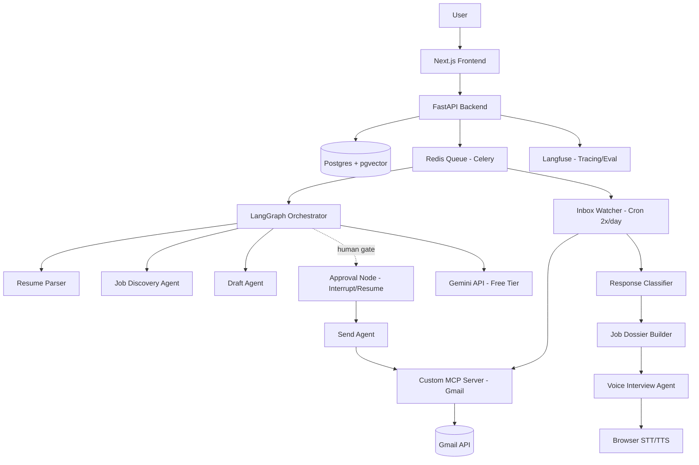

# PRD — AgentHire
### Autonomous, Human-in-the-Loop Job Application & Interview-Prep Platform

**Version:** 1.0
**Owner:** Solo developer (you) — Tech Lead + Sole Engineer
**Target build time:** 1 month, solo
**Cost target:** $0 — every service on free tier

---

## 0. Interpretation Notes (read this first)

Some requirements were described conversationally. Here's how they're translated into concrete specs, so there's no ambiguity while building:

| You said | Built as |
|---|---|
| "agent which will throw to an entire internet and get me the press link" | **Job Discovery Agent** — searches job-board APIs + company career pages, returns job posting URLs matched to your resume |
| "I'll be just giving you the loop" | **Human-in-the-loop approval** — agent drafts, you review/edit, you approve before anything is sent |
| "call through my mail list inboxes and see the mail" | **Inbox Watcher Agent** — polls Gmail (label-scoped, not full inbox) to confirm send + detect replies |
| "voice agent will call to the internet... make it JDU" | **Company & Role Research Agent** — web-researches the company/role, builds an enriched "Job Dossier" (JD + company context) — feeds the **Voice Interview Agent**. (No literal phone calls are made — "call" = agent invocation, "JDU" = enriched JD.) |
| "voice agent taking the interview" | **Voice Mock-Interview Agent** — browser-based voice Q&A using the Job Dossier |

If any of these interpretations don't match your intent, flag it before Day 1 — changing the agent contract later costs a rebuild, not a tweak.

---

## 1. Product Vision

**One-liner:** *AgentHire finds jobs, drafts your outreach, and tracks the entire pipeline — but never sends anything without you saying yes.*

**Pitch (SaaS framing):**
> Job searching is five disconnected chores: finding roles, tailoring outreach, tracking status, monitoring your inbox, and prepping for interviews. AgentHire is a single agentic pipeline that does all five — with a human-approval checkpoint before every email goes out, so users get automation without losing control or trust.

**Wedge vs. competitors (LoopCV, AIApply, Tsenta, etc.):** those tools auto-apply blind. AgentHire's differentiation is **the approval gate** — every draft is reviewed by the user before it's sent from their real Gmail. This is a trust/control product, not a spam-more-applications product.

---

## 2. Goals & Non-Goals

### Goals
- End-to-end pipeline: resume → job match → draft → approve → send → track → detect response → prep interview
- Fully agentic (LangGraph orchestration), not a linear script
- Real MCP server for Gmail (not a wrapped API call) — protocol-correct tool integration
- 100% free-tier infrastructure, documented upgrade path to paid
- Deployed, demoable, defensible in an interview (architecture + tradeoffs)

### Non-Goals (explicitly out of scope for v1)
- Actual outbound phone calls — nothing here dials a phone
- Auto-apply without human approval (by design — this is the differentiator, not a missing feature)
- Support for non-Gmail providers (Outlook, etc.) — v2
- Mobile app — web only
- Multi-tenant billing/payments — v1 is single-user or small-beta, not commercialized

---

## 3. Target User

- Active job seeker applying to multiple roles per week
- Wants leverage/automation but doesn't trust "fire and forget" auto-apply tools
- Comfortable reviewing AI drafts before they go out
- Values a visible pipeline (status tracker) over a black box

---

## 4. Feature Specification (Complete)

### 4.1 Resume Ingestion
- Upload PDF/DOCX resume
- Parse to structured JSON: contact info, skills, experience, education, projects
- Store with versioning (user can re-upload; old versions retained)
- OCR fallback for scanned/image-based resumes

### 4.2 Job Discovery Agent
- Input: parsed resume
- Sources: job-board APIs (Adzuna, JSearch, or similar free-tier APIs) — **not raw scraping of LinkedIn/Indeed** (ToS risk, IP bans)
- Optional: targeted company career-page fetch when user names a specific company
- Matching: resume embedding vs job description embedding (cosine similarity, pgvector)
- Output: ranked list of job postings with URL, title, company, match score

### 4.3 Draft Agent
- Input: one selected job + resume
- Tool-calling LLM (Gemini) generates:
  - Tailored outreach email (subject + body)
  - Optionally tailored resume bullet suggestions (not a full rewrite — flagged edits)
- Structured output (Pydantic schema) — never free-text unvalidated output

### 4.4 Human-in-the-Loop Approval
- Dashboard shows draft side-by-side with original
- Actions: **Approve**, **Edit then approve**, **Regenerate**, **Reject**
- Nothing proceeds to send without explicit approval — this is a hard gate in the LangGraph state machine (interrupt node), not a UI convention

### 4.5 Send Agent (Gmail MCP Server)
- Custom-built MCP server exposing a `send_email` tool
- OAuth2 (Gmail scoped to `gmail.send` + `gmail.readonly` with label restriction)
- Idempotency key per send (prevents duplicate sends on retry/crash)
- Resume attached automatically

### 4.6 Application Tracker
- Status pipeline: `uploaded → matched → drafted → approved → sent → awaiting_response → replied → shortlisted → interview → rejected`
- Every transition is logged (audit trail — who/what/when, human or agent-triggered)
- Dashboard table + per-application detail view

### 4.7 Inbox Watcher Agent (Scheduled)
- Runs 2x/day (cron via Celery beat)
- Gmail search scoped to a label/thread (not full inbox read — privacy + quota discipline)
- Confirms: was the email actually sent (matches Sent folder)?
- Detects: any reply in the thread?

### 4.8 Response Classifier
- On detected reply: Gemini classifies → `positive/shortlisted`, `rejected`, `interview_invite`, `no_signal`
- Confidence score returned alongside classification
- **Low-confidence classifications are flagged for human review, never auto-applied silently** — this is a deliberate safety pattern (evaluator/critic loop), not a shortcut

### 4.9 Company & Role Research Agent ("Job Dossier Builder")
- Triggered when status reaches `shortlisted` or `interview_invite`
- Re-fetches the job posting + does light web research on the company (about page, recent news)
- Extracts: required skills, likely interview themes, company context
- Output: a structured "Job Dossier" — this feeds the voice agent

### 4.10 Voice Mock-Interview Agent
- Input: Job Dossier + resume
- Generates: 10-15 likely questions, STAR-story prompts drawn from the user's real resume
- Delivery: browser-based voice session (STT/TTS) — user answers out loud, agent asks follow-ups
- Session transcript saved for review

### 4.11 Multi-Agent Orchestration
- LangGraph supervisor coordinates all agents above as nodes in one durable, checkpointed graph
- Failure recovery: if a node fails (API timeout, rate limit), the graph resumes from last checkpoint — not from scratch

---

## 5. System Architecture



### Layered Backend Architecture
```
Route Layer (FastAPI routers)
   ↓
Service Layer (business logic, orchestration triggers)
   ↓
Repository Layer (DB access, no business logic)
   ↓
PostgreSQL / Redis
```
Follow **Clean/Layered Architecture** strictly — no DB queries inside route handlers, no business logic inside repositories. This is what makes the codebase defensible in a system-design interview conversation.

---

## 6. Tech Stack (100% Free Tier)

| Layer | Choice | Free Tier Notes |
|---|---|---|
| Frontend | Next.js 14 (App Router) + TypeScript + Tailwind + TanStack Query | Deploy on Vercel free tier |
| Backend | FastAPI (Python, async) | Deploy on Render/Railway/Fly.io free tier |
| Database | PostgreSQL + pgvector | Supabase free tier (includes pgvector) |
| Cache/Queue broker | Redis | Upstash free tier |
| Background jobs | Celery + Celery Beat | Runs on same free-tier backend instance |
| LLM (agents) | Gemini 2.5 Flash | Free tier: ~10-15 RPM, ~250-1500 RPD (verify current limits) |
| LLM (bulk/cheap tasks) | Gemini 2.5 Flash-Lite | Higher RPM, use for classification |
| Embeddings | `text-embedding-004` | Free tier, separate quota from chat models |
| Agent orchestration | LangGraph | Open-source, self-hosted, no cost |
| Tool protocol | Custom MCP server (Python) | Self-hosted, no cost |
| Email | Gmail API (OAuth2) | Free within Google's standard API quotas |
| Voice | Web Speech API (browser-native STT/TTS) | Free — avoids paid Realtime API tiers |
| Observability | Langfuse (self-hosted or free cloud tier) | Agent tracing, cost tracking |
| Evaluation | Ragas (open-source) | Run locally/CI, no cost |
| CI/CD | GitHub Actions | Free minutes for public/small private repos |
| Auth | Google OAuth2 (NextAuth or custom) | Free |

**Explicit tradeoff to state in interviews:** free tier = low RPM ceilings. Architecture must queue everything through Redis/Celery — never fire parallel LLM calls — with exponential backoff + jitter on 429s. This constraint is treated as a design input, not an afterthought.

---

## 7. Data Model (Core Tables)

```
users            (id, email, oauth_tokens, created_at)
resumes          (id, user_id, version, parsed_json, raw_file_url, created_at)
job_postings     (id, source_url, title, company, jd_text, embedding, fetched_at)
applications     (id, user_id, resume_id, job_id, status, created_at, updated_at)
drafts           (id, application_id, subject, body, version, approved_at, approved_by)
sends            (id, application_id, idempotency_key, sent_at, gmail_thread_id)
inbox_events     (id, application_id, detected_at, classification, confidence, raw_snippet)
job_dossiers     (id, application_id, research_json, generated_at)
interview_sessions (id, application_id, transcript, questions_json, created_at)
audit_log        (id, entity_type, entity_id, action, actor, timestamp)
```

---

## 8. Agent State Machine (LangGraph)

**State object carries:** `resume`, `job`, `draft`, `approval_status`, `send_result`, `inbox_status`, `dossier`, `error_context`

**Key nodes:**
1. `parse_resume` → 2. `discover_jobs` → 3. `draft_email` → 4. **`await_approval` (interrupt — graph pauses here, checkpointed to DB)** → 5. `send_email` → 6. `watch_inbox` (separate scheduled entry point, not linear) → 7. `classify_response` → 8. `build_dossier` (conditional: only if shortlisted) → 9. `prep_interview`

**Patterns used:**
- **Interrupt/resume** for human approval (durable — survives server restart)
- **Evaluator/critic loop** on response classification (low confidence → human review branch)
- **Retry with backoff** on every LLM/API-calling node
- **Conditional routing** — dossier/interview branch only fires on positive classification

---

## 9. MCP Server Design (Gmail)

```
Server: agenthire-gmail-mcp
Transport: stdio (local) or Streamable HTTP (deployed)

Tools exposed:
  - send_email(to, subject, body, attachment_id, idempotency_key) -> {status, thread_id}
  - search_inbox(label, query, since_date) -> [{message_id, snippet, from, date}]
  - get_thread(thread_id) -> {messages: [...]}

Auth: OAuth2, token refresh handled server-side, scoped minimally
  (gmail.send + gmail.readonly restricted to a specific label)
```

Build this as a genuinely standalone MCP server (not a disguised REST wrapper) — this is your strongest differentiating technical artifact for interviews.

---

## 10. Security Requirements

- OAuth2 tokens encrypted at rest, never logged
- Idempotency keys on every send (prevent duplicate sends on retry)
- Gmail scope minimization — label-restricted read, not full inbox
- Prompt injection defense: sanitize/neutralize any text pulled from job postings or emails before feeding to LLM as context (treat external text as untrusted input)
- Rate limiting per user on all agent-triggering endpoints
- Full audit log on every state transition and every send
- Kill switch: user can pause all automation for their account instantly

---

## 11. Evaluation & Observability

- **Golden dataset:** 15-20 resume/JD pairs, hand-labeled expected matches — used to test the discovery + draft agents
- **LLM-as-judge:** score draft quality (relevance, tone, factual grounding against resume)
- **Langfuse tracing:** every agent run traced — tokens, latency, cost per request, full trajectory
- **Metrics to track from day 1:**
  - Draft → approval rate (is AI quality good?)
  - Approval → reply rate (is targeting good?)
  - Reply → shortlist rate (funnel health)
  - Cost/latency per application (free-tier budget awareness)

---

## 12. Testing Strategy

| Type | Coverage |
|---|---|
| Unit | Resume parser, classifiers, repository layer |
| Integration | FastAPI routes, DB transactions |
| Agent trajectory | At least 1 full LangGraph run test (mocked LLM) verifying node sequence + interrupt behavior |
| E2E | Playwright — upload resume → approve draft → see tracker update |

---

## 13. Prerequisite Concepts (Read/Understand Before Building)

- **Backend:** REST design, layered architecture, repository pattern, dependency injection, idempotency, rate limiting
- **DB:** Postgres transactions/ACID, indexing basics, pgvector/ANN search fundamentals
- **Agentic AI:** ReAct pattern, planner/executor, human-in-the-loop, evaluator/critic loops, state machines
- **LangGraph specifically:** nodes/edges, checkpointing, interrupt/resume, durable execution
- **MCP:** client/server architecture, tools vs resources vs prompts, transport types, auth model
- **LLM engineering:** structured outputs, function/tool calling, prompt versioning, cost/latency tradeoffs
- **Security:** OAuth2 flow, prompt injection, secrets management, least-privilege scoping
- **Production ops:** retry/backoff, circuit breakers, queue-based processing, observability basics

If any of these are unfamiliar, spend 1-2 hours reading before that day's build block — do not build blind.

---

## 14. Build Phases (Solo, 1 Month)

| Phase | Days | Deliverable |
|---|---|---|
| 1 — Foundation | 1-2 | Repo, DB schema, auth, project scaffolding |
| 2 — Ingestion & Matching | 3 | Resume parse, pgvector embeddings, job discovery |
| 3 — Agent Core | 4-6 | LangGraph setup, draft agent, human-in-loop approval |
| 4 — MCP & Send | 7-8 | Custom MCP server, Gmail send, idempotency |
| 5 — Tracking | 9 | Tracker service, dashboard, audit log |
| 6 — Background Jobs | 10-11 | Redis/Celery, inbox watcher, response classifier |
| 7 — Dossier & Voice | 12-13 | Research agent, voice interview agent |
| 8 — Hardening | 14 | Tests, Langfuse tracing, rate-limit/backoff handling |
| 9 — Ship | 15 | Docker, CI/CD, deploy, README, demo video, ADRs |
| Buffer | 16-30 | Bug fixes, polish, prepare interview talking points, record demo |

---

## 15. Risks & Mitigations

| Risk | Mitigation |
|---|---|
| Gmail send-as-user reputation risk | Human approval gate is mandatory, not optional |
| Free-tier rate limits break under load | Queue-based processing, model routing (Flash-Lite for bulk), backoff+jitter |
| Misclassified email replies | Confidence threshold + human-review fallback, never silent auto-action |
| Google OAuth verification wall at scale | Ship under unverified/testing mode (100-user cap) for showcase; document CASA process as future work |
| Solo dev scope creep | Follow phase order strictly; voice/dossier features are last, cut first if behind schedule |

---

## 16. Success Criteria (Definition of "Done")

- [ ] User can upload resume and see matched jobs with scores
- [ ] User can approve/edit/reject a drafted email before it sends
- [ ] Approved emails send successfully via the custom MCP Gmail server, with idempotency
- [ ] Tracker dashboard reflects real-time status changes
- [ ] Inbox watcher runs on schedule and classifies at least basic reply types
- [ ] Shortlisted applications generate a Job Dossier
- [ ] Voice interview session runs end-to-end in-browser
- [ ] Entire stack deployed live, on free tier, with a working public URL
- [ ] README + 1-2 ADRs + architecture diagram present in repo
- [ ] At least one full agent trajectory has a Langfuse trace you can show

---

*This document is the single source of truth for scope. Any feature not listed here is out of scope until this PRD is revised.*